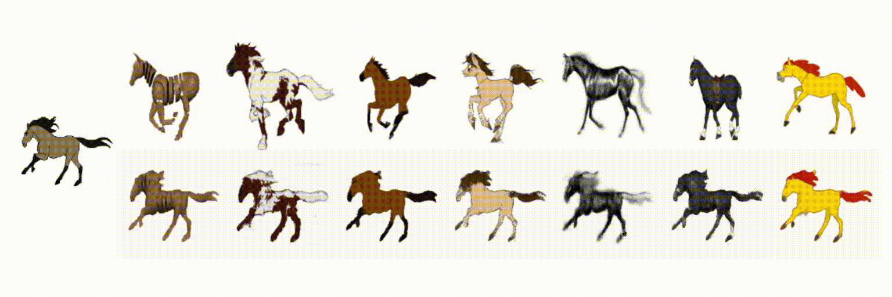

# Image Animation
Image animation form one video and one image.

Learning only requires one video, one image, and two intermediate representation images. Training dataset is not required.

## Examples of motion transfer
### MGIF Dataset


## Environments
- Python 3.6
- Pytorch 1.2

## Usage
1. Transfer from video to intermediate representation

To train TuiGAN model on two unpaired images, put the first image of the video under datas/task_name/trainA and the intermediate representation image under datas/task_name/trainB, and run.
```
python train.py --input_name "input_name" --root "datas/task_name"
python transfer.py --model_name "model_name" --input_dir "input_dir" --input_name "input_name"
```

2. Transfer from intermediate representation to image

To train SemIA model, put the image and the intermediate representation under datas/input_name and the transfered intermediate representation from the video under datas/input_name/cond, and run.
```
python train.py  --input_name "input_name"
python test.py --input_name "input_name" --target_seg_dir "datas/input_name/cond" --exp_path "model_dir"
```

3. Convert image to gif
```
python image2gif.py --input_dir "input_dir" --input_name "input_name"
```

## Evaluation
### Reconstruction
```
python recon_score.py --path2real "source_video_frame" --path2fake "generated_video_frame"
```

### SIFID
```
python sifid_score.py --path2real "source_video_frame" --path2fake "generated_video_frame"
```

## Reference
- https://github.com/tamarott/SinGAN
- https://github.com/linjx-ustc1106/TuiGAN-PyTorch
- https://github.com/ddlee-cn/SemIA